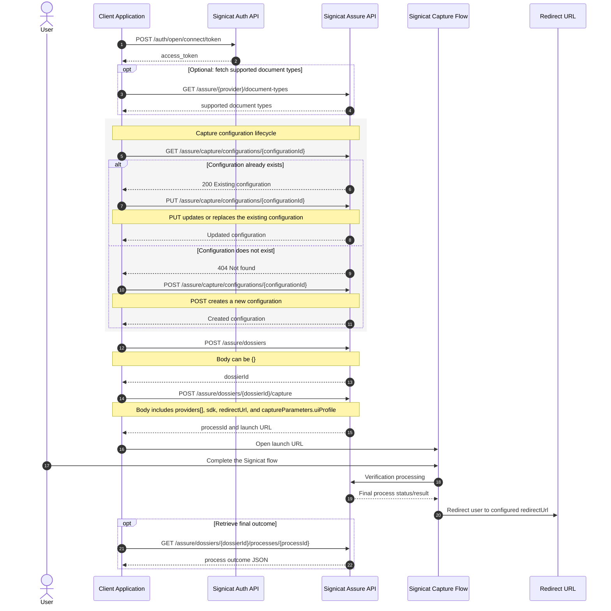

# Signicat Capture And Assure Flow Explainer

This document describes the end-to-end flow from a Signicat API perspective.

It is intended as a handoff note for discussing:

- how a capture configuration is created or updated
- how that configuration is attached to a capture launch
- how the flow progresses from dossier creation to a final process outcome

## API Resources Involved

The main Signicat resources in this flow are:

- capture configuration
- dossier
- capture process
- process outcome

At a high level:

- a capture configuration defines the frontend behavior and restrictions
- a dossier is the container for a verification session
- starting capture creates a process inside a dossier
- the process eventually reaches an outcome that can be retrieved later

## `POST` Versus `PUT`

From a Signicat API perspective:

- `POST /assure/capture/configurations/{configurationId}` creates a new capture configuration
- `PUT /assure/capture/configurations/{configurationId}` updates or replaces an existing capture configuration

That means the correct method depends on whether the configuration already exists.

A safe integration pattern is:

1. Check whether the configuration exists
2. If it exists, call `PUT`
3. If it does not exist, call `POST`

The same distinction applies conceptually even if an implementation chooses a different way to detect existence.

## End-To-End API Flow

The Signicat API flow is:

1. Authenticate and obtain an access token
2. Optionally fetch supported document types
3. Create or update a capture configuration
4. Create a dossier
5. Start capture for that dossier
6. Pass the chosen capture configuration as `captureParameters.uiProfile`
7. Let the end-user complete the capture flow
8. Retrieve the resulting process outcome

## Mermaid Sequence Diagram



## Payloads That Matter Most

### Create dossier

Typical request:

```json
{}
```

Endpoint:

- `POST /assure/dossiers`

### Create or update capture configuration

Endpoint:

- `POST /assure/capture/configurations/{configurationId}` for create
- `PUT /assure/capture/configurations/{configurationId}` for update

The exact JSON body depends on the frontend behavior you want to configure.

Typical fields include:

- generic capture restrictions such as `documentTypes`
- language and country settings
- provider-specific settings such as `signicatvideoidConfig.allowedIdTypes`
- visual or UI customization fields

### Start capture

A typical launch payload looks like this:

```json
{
  "providers": [
    {
      "provider": "signicatvideoid",
      "processType": "substantialFullyAuto"
    }
  ],
  "sdk": "native",
  "redirectUrl": "http://localhost:3000/callback",
  "captureParameters": {
    "uiProfile": "videoid-sandbox-demo"
  }
}
```

Endpoint:

- `POST /assure/dossiers/{dossierId}/capture`

Important detail:

- the capture configuration is referenced through `captureParameters.uiProfile`

## What To Verify In Any Integration

If a team is troubleshooting create-versus-update behavior or capture launch behavior, these are the important checks:

- the integration uses `POST` only when creating a new capture configuration
- the integration uses `PUT` when updating an existing capture configuration
- the configuration ID being updated is the same ID later used as `captureParameters.uiProfile`
- the capture launch payload nests `uiProfile` under `captureParameters`
- the launched process belongs to the intended dossier
- the final outcome is retrieved using the correct `dossierId` and `processId`

## Common Failure Modes

Common causes of confusion in this flow are:

- always calling `POST` even when the configuration already exists
- calling `PUT` for a configuration ID that was never created
- updating one configuration ID and launching capture with a different one
- placing `uiProfile` in the wrong part of the request body
- assuming the configuration was updated when the launched capture process is still using an older configuration reference

## Implementation Notes In This Repo

The repository can still be used as a concrete example of the API sequence above.

Relevant references:

- save decision logic: [public/app.js](public/app.js)
- capture start form submit: [public/app.js](public/app.js)
- capture launch payload construction: [server.js](server.js)
- capture configuration proxy endpoints: [server.js](server.js)
- request debug formatting in UI: [public/js/dom.js](public/js/dom.js)
